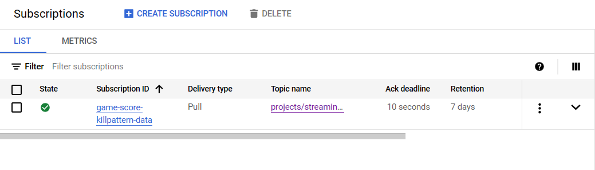

# Real-time-battleroyale-data-streaming
โปรเจคนี้่จะ simulate การแสดงข้อมูลการต่อสู้ของ player ต่างๆในเกมนั้นๆ โดยจะแสดงเป็นข้อมูลอาวุธ ตำแหน่งที่ทำการสังหาร pattern ในการสังหาร และมีการคำนวนคะแนนที่ได้
จาก requirements ต่างๆของอาวุธที่ใช้ และ pattern ในการสังหารควบคู่ไปด้วย และบันทึกข้อมูลลงใน bigquery เพื่อที่จะแสดงข้อมูลในรูปแบบตารางแบบชัดเจน

# ตัวอย่างของข้อมูลที่ Generate ขึ้น
ข้อมูล Generate ขึ้นจาก file Generate_message.py โดยจะ Generate ข้อมูลดังนี้
1. player_name เป็นชื่อของผู้เล่นที่ทำการสังหาร
2. weapon เป็นอาวุธที่ผู้เล่นใช้ในการสังหาร ซึ่งมี 6 ประเภทอาวุธคือ 1.Rifle 2.Pistol 3.Knife 4.Ak47 5.Shotgun 6.Sniper
3. map_location ตำแหน่งที่ทำการสังหาร
4. kill_pattern pattern ที่ใช้ในการสังหาร ซึง่มี 3 ประเภทของการสังหารนั่นคือ 1.Headshot 2.Normal 3.Lastshot
5. player_killed_name เป็นชื่อของผู้เล่นที่โดนสังหาร

# Requirements ในการคำนวนคะแนนที่ได้จากการสังหาร
1. ถ้าผู้เล่นใช้ Rifle ในการสังหารถ้า pattern ในการสังหารคือ Normal จะได้ 2 คะแนน ถ้า LastShot ได้ 1 คะแนน ถ้า Headshot ได้ 5 คะแนน
2. ถ้าผู้เล่นใช้ Pistol ในการสังหารถ้า pattern ในการสังหารคือ Normal จะได้ 3 คะแนน ถ้า LastShot ได้ 1 คะแนน ถ้า Headshot ได้ 5 คะแนน
3. ถ้าผู้เล่นใช้ Knife ในการสังหารถ้า pattern ในการสังหารคือ Normal จะได้ 3 คะแนน ถ้า LastShot ได้ 1 คะแนน ถ้า Headshot ได้ 5 คะแนน
4. ถ้าผู้เล่นใช้ Ak47 ในการสังหารถ้า pattern ในการสังหารคือ Normal จะได้ 2 คะแนน ถ้า LastShot ได้ 1 คะแนน ถ้า Headshot ได้ 5 คะแนน
5. ถ้าผู้เล่นใช้ Shotgun ในการสังหารถ้า pattern ในการสังหารคือ Normal จะได้ 2 คะแนน ถ้า LastShot ได้ 1 คะแนน ถ้า Headshot ได้ 5 คะแนน
6. ถ้าผู้เล่นใช้ Sniper ในการสังหารถ้า pattern ในการสังหารคือ Normal จะได้ 4 คะแนน ถ้า LastShot ได้ 1 คะแนน ถ้า Headshot ได้ 7 คะแนน

# การเตรียมการในการทำโปรเจค
1. สร้าง topic ขึ้นมา 1 topic ขึ้นมา
Example

2. สร้าง subcription ของ game-score-kill-pattern-data ขึ้นมา
Example

3. uploadfile Generate_message.py และ Game_player_score_data.py บน Cloud Shell Editor
4. ทำการสร้าง Bigquery เพื่อรับข้อมูลโดย Dataset ต้องมี Region เดียวกับ cloud storage ในขั้นตอนถัดไป 
และมีจำนวน 6 Columns ดังนี้

 Column ที่ 1 คือ player_name สำหรับบันทึกชื่อของ player ที่สังหาร \
 Column ที่ 2 คือ weapon สำหรับบันทึกอาวุธที่ใช้สังหาร \
 Column ที่ 3 คือ kill_pattern สำหรับบันทึก pattern ในการสังหาร \
 Column ที่ 4 คือ map_location สำหรับบันทึกตำแหน่งในการสังหาร \
 Column ที่ 5 คือ player_killed สำหรับบันทึกชื่อของ player ที่โดนสังหาร \
 Column ที่ 6 คือ score สำหรับบันทึกคะแนนของ player ที่สังหาร \
 schema ของ table
 
 
<pre><code>
[
 {
  "mode": "NULLABLE",
  "name": "player_name",
  "type": "STRING"
 },
 {
  "mode": "NULLABLE",
  "name": "weapon",
  "type": "STRING"
 },
 {
  "mode": "NULLABLE",
  "name": "kill_pattern",
  "type": "STRING"
 },
 {
  "mode": "NULLABLE",
  "name": "map_location",
  "type": "STRING"
 },
 {
  "mode": "NULLABLE",
  "name": "player_killed",
  "type": "STRING"
 },
 {
  "mode": "NULLABLE",
  "name": "score",
  "type": "STRING"
 }
]
   </code></pre>

5.สร้าง cloud storage สำหรับเก็บข้อมูลและ folder temp \
Example

6.Enable Dataflow API 

# เริ่มต้นโปรเจค
1. ทำการ run Generate_message.py บน Cloud Shell Editor

 
  <pre><code>python Generate_message.py</code></pre>

จะได้ตัวอย่างข้อมูลคือที่ generate ขึ้นมาดังนี้ 

2. สร้าง Dataflow ขึ้นมาโดยใช้คำสั่งบน cloud shell 

 
  <pre><code>
   python Dataflow_pipeline.py \
  --project=(your project id) \
  --region=(your region) \
  --input_subscription=projects/(your project id)/subscriptions/(your subsciption) \
  --output_table=(your project id).(your data set).(your table) \
  --runner=DataflowRunner \
  --temp_location=gs://(your cloud storage)/temp \
  --num_workers=1 \
  --max_num_workers=1 \
  --experiment=use_unsupported_python_version
  </code></pre>

จะได้ Dataflow pipeline ขึ้นมาดังนี้ 

3. รอสักพักใหญ่ๆ เพื่อประมวลผล 
4. ตัวอย่างข้อมูลที่บันทึกลงไปใน Bigquery 

